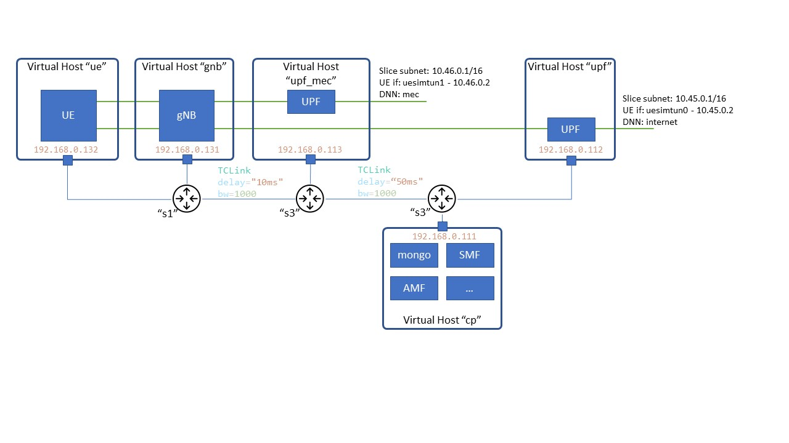
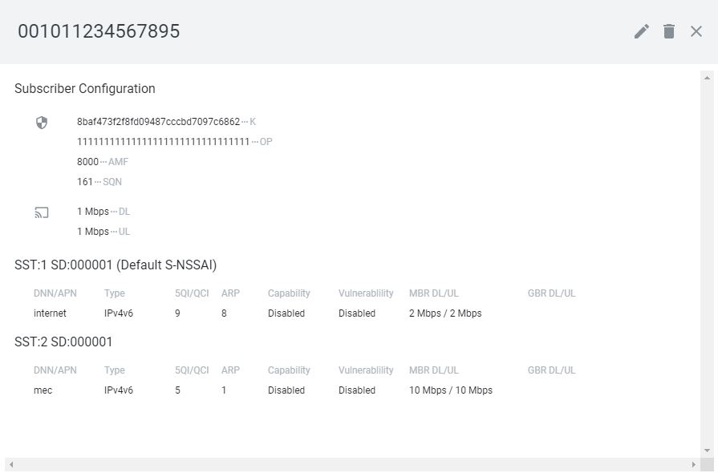

Emulate a 5G network deployment in comnetsemu.
Demonstrate distributed UPF deployment and slice-base UPF selection.

Tested Versions:
- Comnetsemu: v0.3.0 (Installed following either "Option 1" or "Option 3" from [here](https://git.comnets.net/public-repo/comnetsemu) )
- UERANSIM: v3.2.6
- Open5gs: v2.4.2

Python packages:
- pymongo
- json

## Build Instructions

Clone repository in the comnetsemu VM.

Build the necessary docker images:

```
cd build
./build.sh
```

Or alternatively download them from DockerHub

```
cd ../open5gs
./dockerhub_pull.sh
```


## Run experiments

### Start the network topology:

#### Running example1.py
```
$ sudo python3 example1.py
```

The scenario includes 5 DockerHosts as shown in the figure below.
The UE starts two PDU session one for each slice defined in the core network.

</img>

Notice that at the first run the set-up should not work due to missing information in the 5GC.
To configure it we should leverage the WebUI by opening the following page in a browser on the host OS.
```
http://<VM_IP>:3000/
```

The configuration is as follows:

UE information:
- IMSI = 001011234567895
- USIM Type = OP
- Operator Key (OPc/OP) = 11111111111111111111111111111111
- key: '8baf473f2f8fd09487cccbd7097c6862'

Slice 1 configuration
- SST: 1
- SD: 000001
- DNN: internet
- Session-AMBR Downlink: 2 Mbps
- Session-AMBR Uplink: 2 Mbps

Slice 2 configuration
- SST: 2
- SD: 000001
- DNN: mec
- Session-AMBR Downlink: 10 Mbps
- Session-AMBR Uplink: 10 Mbps

The configuration should look like this:

</img>

You can now proceed testing the environment as below


#### Running example2.py
This example creates the same environment of example1.py but the open5GS control plane configuration is done programmatically without using the webUI. (Note: adapted the python class in the open5gs repo [here](https://github.com/open5gs/open5gs/blob/main/misc/db/python/Open5GS.py) )

Disclaimer: all the previous subcribers registered with the webUI will be lost and a new one will be created.

```
$ sudo python3 example2.py
```


### Check UE connections

Notice how the UE DockerHost has been initiated running `open5gs_ue_init.sh` which, based on the configuration provided in `open5gs-ue.yaml`, creates two default UE connections.
The sessions are started specifying the slice, not the APN. The APN, and thus the associated UPF, is selected by the 5GC since, in `subscriber_profile.json`, a slice is associated to a session with specific DNN.

Enter the container and verify UE connections:

``` 
$ ./enter_container.sh ue

# ifconfig
``` 

You should see interfaces uesimtun0 (for the upf_cld) and uesimtun1 (for the upf_mec) active.

```
uesimtun0: flags=369<UP,POINTOPOINT,NOTRAILERS,RUNNING,PROMISC>  mtu 1400
        inet 10.45.0.2  netmask 255.255.255.255  destination 10.45.0.2
        unspec 00-00-00-00-00-00-00-00-00-00-00-00-00-00-00-00  txqueuelen 500  (UNSPEC)
        RX packets 0  bytes 0 (0.0 B)
        RX errors 0  dropped 0  overruns 0  frame 0
        TX packets 0  bytes 0 (0.0 B)
        TX errors 0  dropped 0 overruns 0  carrier 0  collisions 0

uesimtun1: flags=369<UP,POINTOPOINT,NOTRAILERS,RUNNING,PROMISC>  mtu 1400
        inet 10.46.0.2  netmask 255.255.255.255  destination 10.46.0.2
        unspec 00-00-00-00-00-00-00-00-00-00-00-00-00-00-00-00  txqueuelen 500  (UNSPEC)
        RX packets 0  bytes 0 (0.0 B)
        RX errors 0  dropped 0  overruns 0  frame 0
        TX packets 0  bytes 0 (0.0 B)
        TX errors 0  dropped 0 overruns 0  carrier 0  collisions 0
```


Start a ping test to check connectivity:
``` 
# ping -c 3 -n -I uesimtun0 www.google.com
# ping -c 3 -n -I uesimtun1 www.google.com
``` 

### Test the environment

In two terminals start two tcpdump for both upf_cld and upf_mec

``` 
$ ./start_tcpdump.sh upf_cld
$ ./start_tcpdump.sh upf_mec
``` 

#### Latency test
Enter in the UE container:
``` 
$ ./enter_container.sh ue
``` 

Start ping test on the interfaces related to the two slices:
``` 
# ping -c 3 -n -I uesimtun0 10.45.0.1
# ping -c 3 -n -I uesimtun1 10.46.0.1
``` 

Observe the Round Trip Time using uesimtun0 (slice 1 - reaching the UPF in the "cloud DC" with DNN="internet" ) and ueransim1 (slice 2 - reaching the UPF in the 'mec DC' with DNN="mec")


#### Bandwidth test

Enter in the UE container:
``` 
$ ./enter_container.sh ue
``` 

Start bandwidth test leveraging the two slices:
``` 
# iperf3 -c 10.45.0.1 -B 10.45.0.2 -t 5
# iperf3 -c 10.46.0.1 -B 10.46.0.2 -t 5
``` 

Observe how the data-rate in the two cases follows the maximum data-rate specified for the two slices (2 Mbps for sst 1 and 10Mbps for sst 2).


#### Change the maximum bit-rate available for one slice:

Here we change the slice profiles updating the maximum bit-rate and observe the results on the iperf test.

##### Alternative 1
Open the open5gs WebUI and change the DL/UL bandwidth as follows:
- for sst 1: MBR DL/UL = 10 Mbps
- for sst 2: MBR DL/UL = 20 Mbps

##### Alternative 2
Run the script `update_subscribers.py`.

##### Test new connections

Enter in the UE container:
``` 
$ ./enter_container.sh ue
``` 

Start new PDU sessions in the UE: 

```
# ./nr-cli imsi-001011234567895
$ ps-establish IPv4 --sst 1 --sd 1
$ ps-establish IPv4 --sst 2 --sd 1
$ status
```

Now you should see 4 interfaces `uesimtun1-4` created. This is because the old UE connections are kept with the previous settings as long as we do not remove them.

Start again a bandwidth test in the UE leveraging the new PDU session. NB: use the IPs of the inferfaces for the new sessions (`uesimtun3` and `uesimtun4`):

``` 
iperf3 -c 10.45.0.1 -B 10.45.0.3 -t 5
iperf3 -c 10.46.0.1 -B 10.46.0.3 -t 5
```

From the results you should observe that the achieved bit-rate have changed accordingly to the new setting. 


### Contact

Main maintainer:
- Riccardo Fedrizzi - rfedrizzi@fbk.eu


